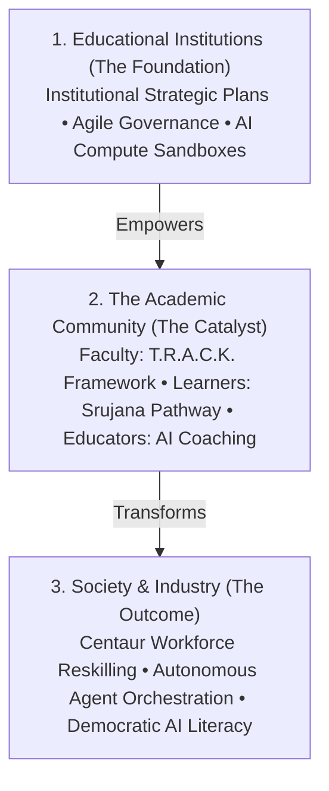
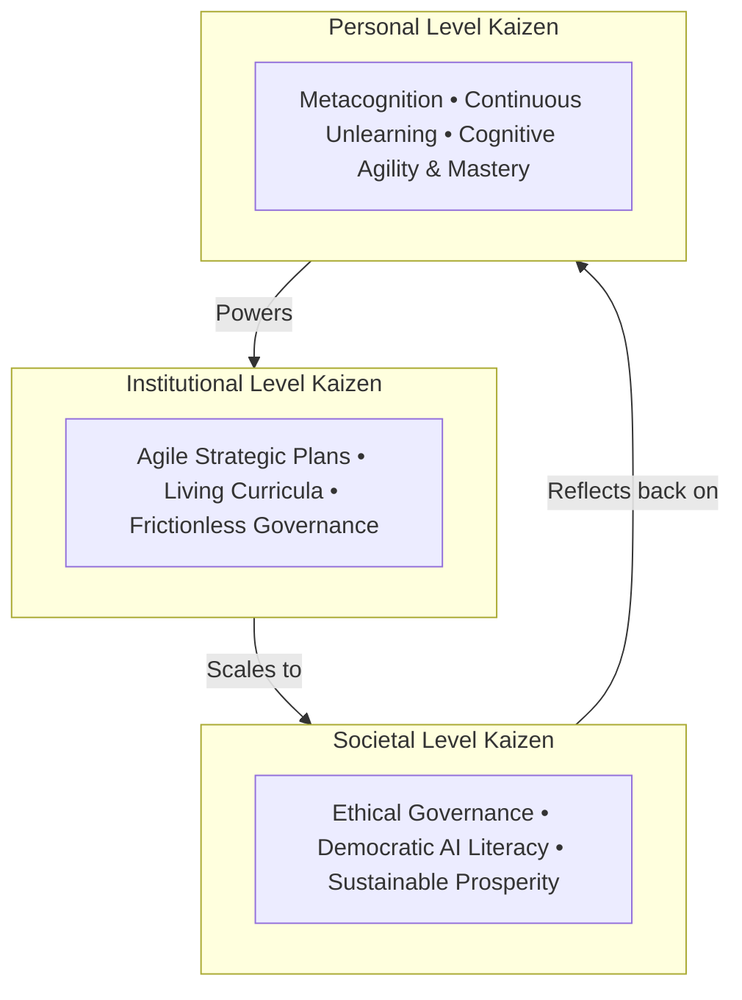
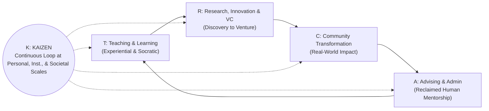

# PROdiGYM - Readiness for Abundant Intelligence

> **Preparing Educational Institutions, the Academic Community, and Thereby Society for Abundant Intelligence**

PROdiGYM is an execution framework, strategic knowledge hub, and operational platform designed to prepare educational institutions, the academic community, and broader society for the era of **Abundant Intelligence**—where synthetic cognition, reasoning models, autonomous agents, and generative systems become zero-marginal-cost utilities.

---

## 🎯 Strategic Vision: The Cascading Transformation

When artificial intelligence transitions from narrow task automation to ubiquitous, autonomous intelligence, societal readiness cannot be achieved through piecemeal training. PROdiGYM drives a **systemic, cascading transformation**:



1. **Educational Institutions (The Foundation)**: Driving Institutional Strategic Plans, living curricula updated on continuous cycles, and frictionless academic operations.
2. **The Academic Community (The Catalyst)**:
   - **Faculty & Academic Leadership**: Empowered across all 5 dimensions of the **T.R.A.C.K. Framework**.
   - **Learners of All Types**: Navigating the **Srujana Pathway** to evolve from passive consumers into creative innovators and autonomous system orchestrators.
   - **Grassroots & Vocational Educators**: Equipped with pedagogical AI assistants and trade simulations.
3. **Society & Industry (The Outcome)**: White-collar workforce reskilling for agent orchestration, ethical governance, and democratic lifelong AI literacy.

---

## 🏛️ The T.R.A.C.K. Framework for Faculty & Academic Leadership

The **T.R.A.C.K.** framework redefines the multidimensional identity, purpose, and daily operations of educators in the age of Abundant Intelligence:

```
┌──────────────────────────────────────────────────────────────────────────────────────────────────────┐
│                                   THE T.R.A.C.K. TRANSFORMATION ENGINE                               │
├───────────────────┬───────────────────┬───────────────────┬───────────────────┬──────────────────────┤
│         T         │         R         │         A         │         C         │           K          │
│ Teaching/Learning │  Research, Innov, │    Advising &     │     Community     │     Kaizen Across    │
│                   │ Consulting, & VC  │  Academic Admin   │  Transformation   │ Personal/Inst./Society│
├───────────────────┼───────────────────┼───────────────────┼───────────────────┼──────────────────────┤
│ Co-learning,      │ Agentic Discovery,│ Hyper-Personalized│ Regional Living   │ Continuous Loop of   │
│ Flipped Socratic  │ Rapid Prototyping,│ Mentorship &      │ Labs & Grassroots │ Metacognitive, Cultural│
│ Experiential Labs │ Deep Tech Ventures│ Agentic Operations│ AI Enablement     │ & Structural Renewal │
└───────────────────┴───────────────────┴───────────────────┴───────────────────┴──────────────────────┘
```

### 1. **T — Teaching & Learning**
*Elevating from Content Delivery to Cognitive Enablement & Co-Exploration*
- **Paradigm Shift**: When AI provides instant, personalized explanations for any concept, broadcast lecturing is obsolete. Teaching transitions into **inquiry-based co-learning, Socratic challenge, problem framing, and evaluation of synthetic outputs**.
- **Strategic Innovations**:
  - **Dynamic Living Case Studies**: Real-time generative simulation of market crashes, engineering failures, or geopolitical crises within the classroom.
  - **AI-Partnered Flipped Classrooms**: Foundational concepts learned via conversational AI tutors (e.g., SrujanaBuddy), reserving classroom sessions for human-centered debates, design sprints, and high-order synthesis.
  - **Assessment Beyond Memorization**: 100% open-book, open-agent, portfolio-driven viva voce and adversarial verification (red-teaming AI outputs).

### 2. **R — Research, Innovation, Consulting, and Venture Creation**
*Collapsing the Distance from Theoretical Inquiry to Scalable Economic & Societal Ventures*
- **Paradigm Shift**: Research cycles accelerate 100x through multi-agent literature syntheses, automated hypothesis generation, code generation, and synthetic data simulation. Consulting and innovation manifest as **deployable prototypes and venture spin-offs within days** rather than theoretical slide decks.
- **Strategic Innovations**:
  - **Venture Studios within Academic Labs**: Departments operate as AI-native venture incubators spinning out Deep Tech, EdTech, AgriTech, and HealthTech startups.
  - **Translational Consulting with Multi-Agent Swarms**: Faculty and student teams offer high-velocity consulting to MSMEs and local industries by orchestrating agentic pipelines.
  - **Collaborative Open Science**: Bridging cross-disciplinary boundaries (e.g., genomics and material science) via foundational AI models.

### 3. **A — Advising and Academic Administration**
*The Sacred Mantle of the Guru: Inspiring, Mentoring, and Awakening Human Potential*
- **The Essential Distinction & Paradigm Shift**:
  - **Teaching/Learning (T)** imparts structured knowledge and cognitive capabilities.
  - **Research & Innovation (R)** creates new discoveries, inventions, and ventures.
  - **Advising (A)** embodies the **"Inspiring Guru"**—the vital, human-to-human core of education that encompasses everything left beyond structured instruction and research:
    - **Awakening Intrinsic Purpose & Passion**: Inspiring learners to discover their *Ikigai*, life mission, and inner spark.
    - **Character, Ethics & Moral Grounding**: Guiding students through moral ambiguities, building emotional fortitude, resilience, and ethical compass in an AI-dominant world.
    - **Holistic Life Mentorship**: Providing psychological safety, listening deeply, navigating crises, and cultivating self-worth.
  - **Academic Administration**: Traditional administrative drudgery (accreditation paperwork, scheduling, rubric audits, routine grading) is automated away via multi-agent workflows—specifically to **liberate the educator's energy to fully inhabit this inspiring Guru role**.
- **Strategic Innovations**:
  - **The AI-Liberated "Guru-Shishya" Dynamic**: With routine administration handled by background agents, faculty-student relationships return to meaningful dialogue, wisdom sharing, and life mentoring.
  - **Predictive Empathy & Friction Sensing**: Agents detect unspoken student distress, burnout, or disengagement patterns and alert the faculty mentor to initiate compassionate human conversations.
  - **Values & Character Portfolios**: Mentors guide students in building reflection journals on ethics, societal responsibility, and human agency alongside their technical portfolios.

### 4. **C — Community Transformation**
*Transforming the University from an Ivory Tower into an Engine of Societal Uplift*
- **Paradigm Shift**: Higher education institutions act as regional anchors and catalysts, democratizing abundant intelligence across local communities, schools, and vocational trades rather than letting it concentrate solely in tech monopolies.
- **Strategic Innovations**:
  - **Regional AI Living Labs**: Faculty-student problem-solving clinics in rural and peri-urban areas for water management, precision agriculture, local language education, and public healthcare.
  - **Upskilling Grassroots Educators**: Faculty leading hands-on training for K-12 and vocational trade teachers in local districts to prevent digital and cognitive divides.
  - **Empowering Local Governance & MSMEs**: Modernizing workflows for municipal bodies and small enterprises using accessible open-source intelligence platforms.

### 5. **K — Kaizen at Personal, Institutional, and Societal Level**
*Continuous, Compounding Metacognitive and Structural Evolution*
- **Paradigm Shift**: Static knowledge degrades rapidly in an exponential era. **Kaizen (continuous improvement)** becomes the ultimate meta-skill—a cultural commitment to perpetual adaptation, unlearning, and compounding refinement across three nested scales:



- **Strategic Innovations Across the Three Tiers**:
  - **Personal Level (Educator/Learner)**: Daily metacognitive reflection, prompt iteration routines, continuous reskilling, and cognitive capability expansion.
  - **Institutional Level (The HEI / School)**: Quarterly agile curriculum audits, continuous policy updates (vs 4-year static revisions), psychological culture of experimentation, fast failure, and rapid sandbox prototyping.
  - **Societal Level (The Ecosystem)**: Active societal feedback loops monitoring the ethical, socioeconomic, and employment impacts of deployed intelligence systems.

---

## 🔄 The Interconnected Flywheel of T.R.A.C.K.

The power of T.R.A.C.K. lies in its synergistic flywheel:



1. **Teaching (T)** sparks project ideas that mature into **Research, Innovation & Ventures (R)**.
2. Ventures and research are deployed directly to achieve **Community Transformation (C)**.
3. Intelligent **Administration & Advising (A)** removes bureaucratic friction, providing faculty the time to mentor students and run high-impact projects.
4. **Kaizen (K)** acts as the overarching continuous tuning mechanism that perpetually optimizes personal habits, institutional agility, and societal alignment.

---

## 🛠️ Operationalizing T.R.A.C.K. Through Collaborative Projects

Every faculty member and institutional department translates T.R.A.C.K. into reality through **Vision-Aligned Collaborative Projects**:

| T.R.A.C.K. Pillar | Collaborative Project Archetype | Key Stakeholders Involved | Concrete Output / Deliverable |
| :--- | :--- | :--- | :--- |
| **T** | AI-Native Flipped Pedagogy Pilot | Faculty + Students + Instructional Designers | Interactive simulation labs, conversational AI tutors, dynamic rubrics |
| **R** | Academic Deep-Tech Venture Incubator | Faculty + Student Founders + Industry Mentors | Functional AI MVPs, venture spin-offs, patent/research pre-prints |
| **A** | Agentic Academic Workflow Automation | Faculty + Admin Staff + Student Engineers | Automated accreditation trackers, predictive mentorship dashboards |
| **C** | Rural / MSME Grassroots AI Clinic | Faculty + Local School Teachers + MSME Owners | Deployed localized AI tools, teacher enablement workshops |
| **K** | Institutional Agility & Personal Growth Cohorts | Academic Leadership + Peer Faculty Circles | Continuous curriculum version control, personal AI mastery roadmaps |

---

## 🌟 The Srujana Pathway (For Learners of All Types)
Complementing T.R.A.C.K., the **Srujana Pathway** prepares learners of all backgrounds to transition from passive consumers into creative innovators and autonomous system orchestrators progress through 4 stages:
1. **Stage 1 (Foundational)**: Complete 3 micro-challenges to prove you can use AI to spot a problem and build a quick prototype.
2. **Stage 2 (Internship/Co-Op)**: Join a team of 3-5 students and an industry mentor to build a solution for a real problem statement.
3. **Stage 3 (R&D / IP)**: Polish the solution, pass an Expert Jury review (HEITL), and potentially publish research or file patents.
4. **Stage 4 (Incubation)**: Launch the project as a startup, or leverage your incredible portfolio to land a top-tier role.

We will follow four core philosophies:
1. **Experiential Learning**: Direct engagement in real-world challenges from day one.
2. **HUman expert orchestrating AI Agents**: Leveraging AI as a creative partner, cognitive amplifier, and intellectual sparring partner.
3. **Focus on Human-Centric Future Skills**: Critical Thinking, Creativity, Collaboration, and Communication.
4. **AI-Era Enhanced Outcomes**: Tangible digital portfolios, published whitepapers, verified GitHub repositories, and venture spin-offs.

---

## 📂 Repository Architecture & Directory Structure

PROdiGYM operates as a **Dual-Engine Hub** pairing an enduring strategic knowledge base with active AI-native deliverables:

```text
prodigym/
├── projects/            # Active AI-native projects (sequentially numbered 0 onwards)
│   ├── _template-project/ # Base template with 0-6 lifecycle artifacts
│   └── README.md        # Active project registry & workflow guide
├── wiki/                # Strategic Knowledge Base & Execution Methodologies
│   ├── srujana_pathway.md # The Srujana Pathway for all learners
│   ├── track_framework.md # The T.R.A.C.K. Framework deep dive
│   └── index.md         # Comprehensive Wiki Index
├── strategy/            # Strategic Concept Notes & Institutional Charters
│   └── concept-note.md  # Comprehensive Strategic Concept Note
├── .agents/skills/      # AI Agent Skills (HEITL governance, project engine, peer review)
├── web/                 # React Web Application (Vercel App)
├── supabase/            # Backend Database & Auth
├── planning/            # Operational Task Boards & Meta-Venture Plans
├── outreach/            # Ecosystem Communication Templates
└── docs/                # Deployment & Architecture Guides
```

---

## 📋 The 0-Indexed AI-Native Project Lifecycle (`projects/`)

All collaborative projects in PROdiGYM are structured with **sequential numeric numbering (0 onwards)** so that files appear in strict chronological creation and concept dependency order in all directory listings:

```text
projects/<project-slug>/
├── 0_context.md     # Standing Foundation: Institutional background, facts, constraints, style
├── 1_intent.md      # Stage 1: Envision (problem, opportunity, target audience, done criteria)
├── 2_spec.md        # Stage 2: Scope (locked architecture, requirements, non-goals)
├── 3_draft.md       # Stage 3: Build (AI-native comprehensive first-pass draft)
├── 4_review.md      # Stage 4: Test (red-team critique, factual verification, human expert gate)
├── 5_final.md       # Stage 5: Deploy (polished, authoritative deliverable committed for impact)
└── 6_feedback.md    # Stage 6: Iterate (field outcomes, stakeholder impact, next cycle triggers)
```

To launch a new project, copy `projects/_template-project/` to `projects/<your-project-slug>/` and start by establishing `0_context.md` and `1_intent.md`. See [GETTING-STARTED.md](./GETTING-STARTED.md) and [CONTRIBUTING.md](./CONTRIBUTING.md) for full onboarding details.
