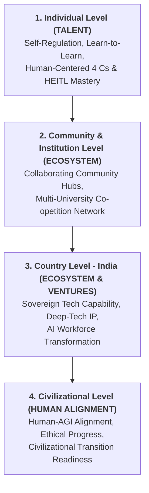
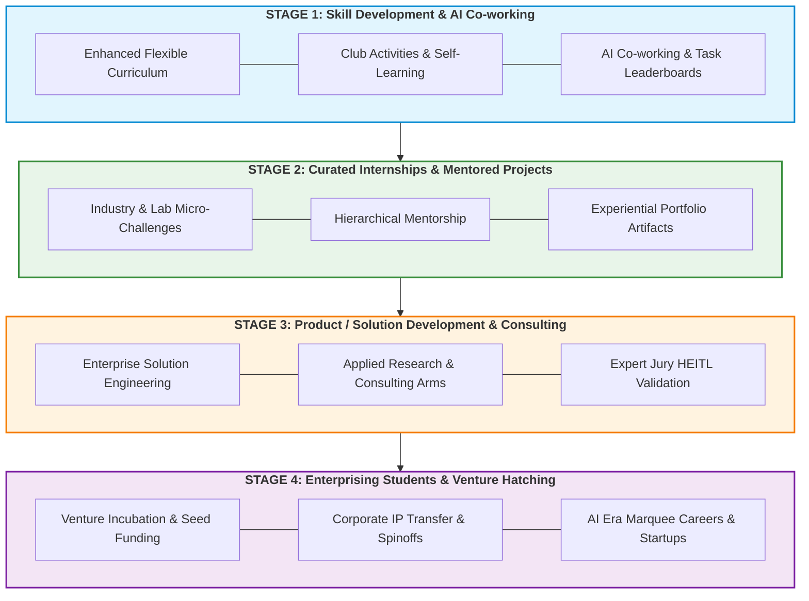
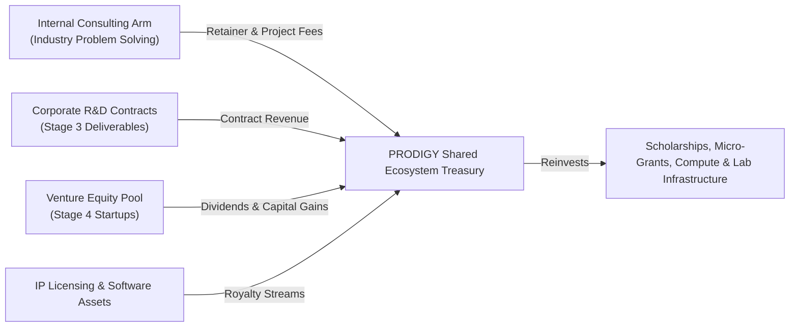

# EXECUTIVE CONCEPT NOTE: PROJECT PRODIGY

> **WHAT:** **P**ipeline for **R**esearch **O**riented **D**evelopment with **I**ntelligence of **G**lobal **Y**outh  
>
> **HOW:** *Building Our Common Future through Human + Augmented Intelligence — A Collaborative Community based Venture Studio for Multi-Tiered Human Centric Development in the AGI Era*  
>
> **RESULTING IN (STRATEGIC TRIAD):**  
> $$\mathbf{TALENT} \;\;\bullet\;\; \mathbf{ECOSYSTEM} \;\;\bullet\;\; \mathbf{VENTURES}$$  
>

---

## 1. Executive Summary 

### 1.1 The Executive Summary: WHY and HOW
* **THE WHY (The Strategic Crisis & Imperative)**:
  As Artificial General Intelligence (AGI) and Super-AI accelerate, standard software and task-based roles are being rapidly automated by machines. Higher education systems globally—and in India specifically—face a critical crisis: traditional freshers-level job roles in software development and IT services are vanishing. To thrive, youth must transition from theoretical instruction and legacy coding to becoming **Human-Experts-in-the-Loop (HEITL)** equipped with human-centered skills: the **4 Cs** (**C**ritical Thinking, **C**ommunication, **C**ollaboration, **C**reativity), personal agency, self-regulation, and a "learn-to-learn" mindset across all STEAM and interdisciplinary fields.

* **THE HOW (Key Operational Idea & Structural Strategy)**:
  PRODIGY executes **collaborative community projects with specific success criteria under a structured hierarchy of mentors**. 
  Crucially, **the structure of community projects itself inherently enforces collaboration and specific focused outcomes.** Instead of passive learning, every activity is structured as an outcome-based project where participants progress through a 4-stage pathway (the **Srujana Pathway**) from zero-barrier skill development (Stage -2 / -1) to commercial venture creation (Stage 4).

```
┌────────────────────────────────────────────────────────────────────────────────────────┐
│                         PROJECT PRODIGY EXECUTION ARCHITECTURE                         │
├────────────────────────────────────────────────────────────────────────────────────────┤
│  1. TALENT PIPELINE (Stage 1 & Stage 2)                                                │
│     • Collaborative projects with specific success criteria & task leaderboards.        │
│     • Structural enforcement of 4 C skills, self-regulation, & AI co-working.          │
│     • Mentor hierarchy (Senior researchers, industry veterans, peer leads).            │
├────────────────────────────────────────────────────────────────────────────────────────┤
│  2. COLLABORATING COMMUNITY ECOSYSTEM (Stage 2 & Stage 3)                              │
│     • Co-opetition framework: Cooperate on shared pre-competitive R&D & compute;       │
│       compete on solution performance & speed-to-market.                               │
│     • Multi-institutional hub-and-spoke network across universities & industry.         │
├────────────────────────────────────────────────────────────────────────────────────────┤
│  3. VENTURES HATCHING (Stage 3 & Stage 4)                                              │
│     • High-performance Collaborative Venture Studio model.                             │
│     • Enterprise software deliverables, corporate R&D, IP transfer, & startups.       │
└────────────────────────────────────────────────────────────────────────────────────────┘
```

### 1.2 The Core  Motto & Triad
PROJECT PRODIGY is anchored around three progressive pillars:
* **TALENT**: Developing human-centered capability through community-based project execution leading to human-centric skill development (4 Cs, personal agency, self-regulation, learn-to-learn mindset, and readiness to work as a Human-Expert-in-the-Loop with Augmented Intelligence across global youth).
* **ECOSYSTEM**: Fostering a self-sustaining, multi-stakeholder **Collaborating Community** network built on a **Co-opetition Model** (*Cooperating in pre-competitive foundational research, compute pooling, and talent building, while competing in downstream venture development and market execution*).
* **VENTURES**: Converting real-world solutions and Stage 3/4 engineering modules into market-ready products, corporate IP, enterprise consulting deliverables, and viable commercial startups for members who have progressed through the pathway.

### 1.3 High-Concept Elevator Pitch
PRODIGY represents a novel institutional synthesis: **A High-Performance Collaborative Venture Studio fused with the Collaborative Sector Model (inspired conceptually by India’s iconic Amul movement) operating via a Co-opetition Paradigm.**

* **The Collaborating Community Model (Co-opetition)**: Democratizes access so anyone with commitment can join at a "minus 1 or minus 2" level with zero barriers and Learn by Doing. Institutions and companies **cooperate** on shared resources, open R&D, and skill building in intiatial stages, while teams **compete** on later stages of solution creation  and downstream venture deployment (**Talent & Ecosystem**).
* **The Venture Studio Rigor**: Provides structured product engineering, active mentorship, IP clearings, venture incubation, seed capitalization, and market launch pathways for members who have demonstrated high competence (**Ecosystem & Ventures**).

---

## 2. The Strategic Imperative: Civilizational Readiness in the AGI Era

The rapid progression toward AGI leaves a narrow strategic window. Traditional freshers-level job roles are disappearing. PRODIGY structures development across **four interconnected tiers**:



### 2.1 The Four Tiers of Development
1. **Individual Level (Talent)**: Cultivating personal agency, self-regulation, continuous learning ("learn-to-learn"), readiness to work as a Human-Expert-in-the-Loop, and human-centered skills: the **4 Cs** (**C**ritical Thinking, **C**ommunication, **C**ollaboration, **C**reativity) and beyond.
2. **Community & Institutional Level (Ecosystem)**: Uniting universities, polytechnics, research centers, and industry nodes into a shared Collaborating Community network rather than siloed campuses.
3. **Country Level - India (Ecosystem & Ventures)**: Transitioning India’s massive demographic dividend from low-margin software maintenance to global IP generation, deep-tech research, and sovereign AI readiness.
4. **Civilizational Level**: Preparing human civilization for collaborative Intelligence with harmonious co-existence and leadership in the era of AGI and Super-AI.

### 2.2 Inclusive Cross-Disciplinary STEAM+ Scope
PRODIGY spans **all branches of human knowledge**:
* **Engineering & STEAM**: Deep learning, hardware, robotics, biotechnology, sustainable energy.
* **Law & Policy**: AI governance, dynamic IP law, ethics, synthetic media regulation.
* **Architecture & Urban Design**: Regenerative habitats, AI-augmented spatial design.
* **Humanities & Management**: Behavioral science, organizational design, economics of collaborative sectors, and social innovation.

---

## 3. The Operating Model: Collaborative Venture Studio + Collaborating Community

### 3.1 Structural Enforcement: Projects as the Learning & Collaboration Unit
The core innovation of PRODIGY is that **collaboration and specific focused outcomes are enforced automatically by the structural design of community projects**:
* **Specific Success Criteria**: Every project defines unambiguous deliverables, peer-evaluation rubrics, and automated quality gates.
* **Mentor Hierarchy**: Senior researchers, industry leaders, and advanced Stage 3/4 participants guide junior teams, creating a continuous feedback loop.
* **Co-opetition Framework**: Pre-competitive cooperation (shared compute, foundation models, evaluation rubrics) combined with market competition (leaderboard challenges, enterprise contracts, venture funding).

```
┌────────────────────────────────────────────────────────────────────────────────────────┐
│                      THE COLLABORATING COMMUNITY CO-OPETITION MODEL                    │
├───────────────────────────────────────────┬────────────────────────────────────────────┤
│           COOPERATE IN THESE AREAS        │          COMPETE IN THESE AREAS            │
├───────────────────────────────────────────┼────────────────────────────────────────────┤
│ • Pre-competitive foundation models & data │ • Leaderboard micro-tasks & sprint challenges│
│ • Pooled compute infrastructure & tools    │ • Enterprise client consulting proposals   │
│ • Shared curriculum & faculty training    │ • Market-facing venture creation & funding │
│ • Universal quality rubrics & HEITL jury   │ • Prototype performance & speed-to-market  │
└───────────────────────────────────────────┴────────────────────────────────────────────┘
```

### 3.2 Hub-and-Spoke Governance Architecture
* **Central Governing Council**: Industry captains, senior researchers, policy advisors, and venture builders defining strategic direction and quality standards.
* **Regional Nodal Hubs**: Established host universities and research centers providing local physical/digital workspace, compute access, and lab hardware.
* **Distributed Talent Spokes**: Student clubs, independent developers, faculty teams, and enterprise problem-solvers collaborating asynchronously via AI-augmented platforms.

---

## 4. The Srujana 4-Stage Pathway (Curriculum-Integrated Progression)

The backbone of PRODIGY is the **Srujana Pathway**, designed to be embedded directly into undergraduate (UG), postgraduate (PG), and doctoral/research curricula, or pursued via flexible co-curricular tracks. Participants progress through 4 distinct stages based on their commitment and capabilities.

### 4.1 Visual Pathway Architecture (Mermaid)



### 4.2 Detailed Breakout of the 4 Stages

| Stage | Branding Triad Progression | Focus & Activities | Curriculum & Platform Integration | Primary Outcomes |
| :--- | :--- | :--- | :--- | :--- |
| **Stage 1: Knowledge, Skill & Attitude Development** | **TALENT** *(Cooperative Learning)* | Flexible enhanced curriculum, student club activities, self-paced learning, competitive micro-task leaderboards. Traditional coding/studying is replaced by **AI-augmented co-work**. | Embedded in UG/PG foundational courses & student clubs. | Self-regulation, AI tool mastery, learn-to-learn attitude, foundational 4 Cs. |
| **Stage 2: Curated Internships & Mentored Projects** | **TALENT $\rightarrow$ ECOSYSTEM** *(Mentored Projects)* | Real-world micro-challenges contributed by startups, enterprise partners, and research labs. Active 1-on-1 and group mentorship. | Recognized for academic credits & industry internship mandates. | Experiential learning, professional discipline, portfolio artifacts, peer validation. |
| **Stage 3: Product / Solution Development & Consulting** | **ECOSYSTEM $\rightarrow$ VENTURES** *(Pre-Competitive Solutions)* | Focused execution on enterprise-grade solutions, consulting engagements, applied research, and prototype build. *Participants focus purely on solution engineering without venture administration burdens.* | Capstone projects, M.Tech/Ph.D. research, internal consulting arm engagements. | High-impact product modules, client revenues, research papers, Expert Jury HEITL validation. |
| **Stage 4: Enterprising Students & Venture Hatching** | **VENTURES** *(Market Competition)* | Venture creation, startup incubation, seed funding access, corporate IP transfer, and marquee career placement in AI-era tech leaders. | Business incubators, university spinoffs, marquee industry recruiting. | Commercial startups, equity distribution, revenue-sharing, global marquee careers. |

### 4.3 The Underlying Transformation Engine
Across all four stages, PRODIGY operates on a unified underlying engine:
$$\text{Learn by Doing} + \text{Augmented by AI} + \text{Human-Centered Skills} \implies \text{AI-Era Careers} + \text{Products/Portfolio} + \text{Branding/Legacy}$$

---

## 5. Sustainable Financial & Revenue Architecture

PRODIGY is designed as a **self-sustaining ecosystem** that does not rely indefinitely on grants or donations:



1. **Internal Consulting Arm**: Stage 3 and Stage 4 teams solve real-world operational and technological challenges for corporate clients, generating immediate cash flow.
2. **Corporate Contract R&D**: Companies outsource specialized exploratory R&D to PRODIGY nodal hubs at a fraction of standard R&D costs.
3. **Venture Studio Equity Pool**: PRODIGY retains a modest equity or revenue-share stake in Stage 4 startup spinoffs. Capital realizations are recycled back into early-stage Srujana micro-grants.
4. **Shared Compute & Resource Efficiency**: By pooling AI compute, software licenses, and cloud credits across participating institutions, fixed overhead per student is minimized.

---

## 6. Stakeholder Value Proposition Matrix ("What's In It For Everyone")

For a collaborative community to succeed, every stakeholder must receive unambiguous, tangible value mapped directly to **Talent, Ecosystem, and Ventures**:

| Stakeholder Group | Branding Focus | What They Give (Contribution) | What They Get (Value Proposition) |
| :--- | :--- | :--- | :--- |
| **Students & Youth** | **TALENT** | Time, commitment to self-development, micro-task contributions, problem-solving. | Zero-barrier entry, AI-era skill mastery, curated industry internships, verified portfolio/branding, marquee careers, or startup founder pathway. |
| **Universities & Faculty** | **ECOSYSTEM** | Infrastructure host, academic credits integration, faculty mentorship. | High-tier industry-relevant curriculum, boosted campus placement metrics, faculty research grants, consulting revenue share, spin-off IP rights. |
| **Government & Policy Makers** | **ECOSYSTEM & NATION** | Policy alignment, regional hub support, innovation grants. | Sovereign tech capability, massive workforce upskilling in AI, economic growth in Tier-2/3 cities, alignment with National Education Policy (NEP) goals. |
| **Mentors & Experts** | **TALENT & ECOSYSTEM** | Domain guidance, jury evaluation, HEITL oversight. | Access to high-energy talent for their own projects, equity co-founding options, advisory fees, continuous connection to cutting-edge AI practices. |
| **Industry & Enterprises** | **VENTURES** | Problem statements, dataset access, expert mentors, project sponsorships. | Access to pre-vetted top talent, rapid low-cost R&D prototyping, custom AI solution deployment, reduced recruitment and training overhead. |

---

## 7. Single Business Value Dashboard & Key Performance Indicators (KPIs)

To maintain execution discipline, PRODIGY tracks progress across the **Talent $\rightarrow$ Ecosystem $\rightarrow$ Ventures** triad through a unified, real-time value dashboard:

```
┌────────────────────────────────────────────────────────────────────────────────────────┐
│                        PRODIGY BUSINESS VALUE DASHBOARD                                │
├──────────────────────────┬──────────────────────────┬──────────────────────────────────┤
│ BRANDING TRIAD CATEGORY  │ KEY INDICATOR            │ TARGET BENCHMARK                 │
├──────────────────────────┼──────────────────────────┼──────────────────────────────────┤
│ 1. TALENT                │ Sprint Tasks Completed   │ >50 micro-tasks per nodal hub    │
│                          │ Leaderboard Velocity     │ Active engagement from >80% youth│
├──────────────────────────┼──────────────────────────┼──────────────────────────────────┤
│ 2. ECOSYSTEM             │ Problem Viability Index  │ Top 20% high-friction industry   │
│                          │ Co-opetition Pool Index  │ >10 institutions sharing compute │
├──────────────────────────┼──────────────────────────┼──────────────────────────────────┤
│ 3. VENTURES              │ Solution Maturity Rubric │ >85% Expert Jury HEITL approval  │
│                          │ Client Acceptance Rate   │ >90% code/product deployment     │
├──────────────────────────┼──────────────────────────┼──────────────────────────────────┤
│ 4. SCALE & YIELD         │ Startups Incubated       │ 10-15 viable ventures / year     │
│                          │ Revenue Re-invested      │ 100% self-sustaining within 3 yrs│
└──────────────────────────┴──────────────────────────┴──────────────────────────────────┘
```

---

## 8. Executive Call to Action for Key Influencers in India

India stands at a pivotal historical junction. With its demographic advantage and technical ambition, India can lead the world in human-centered, AI-augmented collaborative innovation. 

We invite key leaders across policy, academia, industry, and venture capital to advise, partner, and shape PROJECT PRODIGY across its three pillars:

### How You Can Participate:
1. **Nurture the TALENT**: Sponsor Srujana internships, join the Expert Jury network, and mentor high-potential youth.
2. **Build the ECOSYSTEM (Collaborating Community)**: Join the National Founding Advisory Board, host a PRODIGY Nodal Hub, and contribute to shared pre-competitive R&D pools.
3. **Co-create the VENTURES**: Submit high-impact enterprise problem pipelines and co-found or invest in Stage 4 startup spinoffs.

---

### Contact & Related Documents
* **Initiative Lead**: Project PRODIGY Working Group
* **Main Concept Note**: [conceptnote.md](file:///d:/Github/prodigy/conceptnote.md)
* **Spot-Probe Strategy Reference**: [spot_probe_strategy.md](file:///d:/Github/prodigy/spot_probe_strategy.md)
* **Original Proposal Context**: [Augmented Intelligence Project Proposal.md](file:///d:/Github/prodigy/Augmented%20Intelligence%20Project%20Proposal.md)

---

