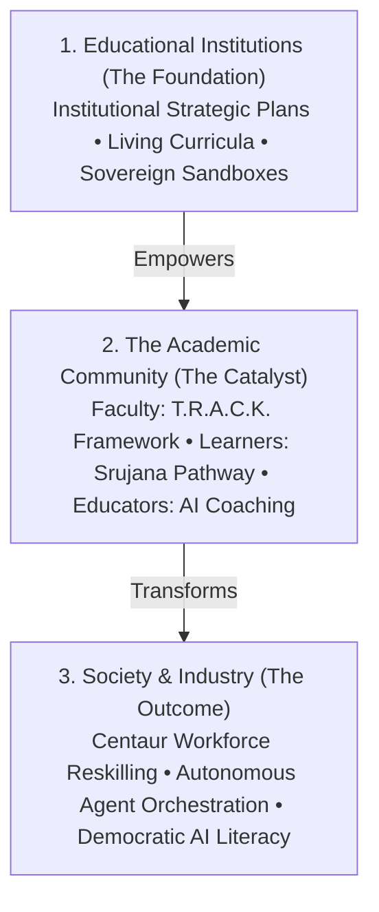
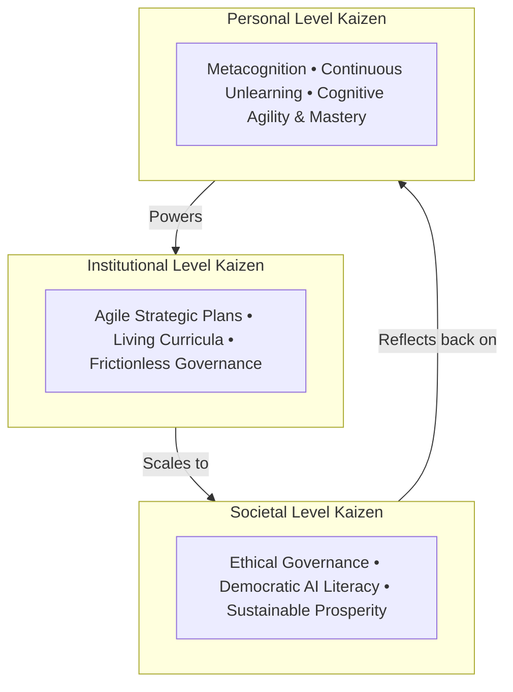
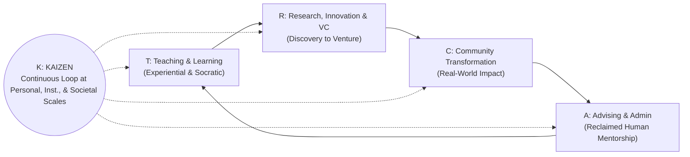

# Strategy: Abundant Intelligence & The T.R.A.C.K. Transformation Concept Note

## 1. Executive Summary & Strategic Context

As artificial intelligence transitions from narrow task automation to ubiquitous, autonomous, and zero-marginal-cost **Abundant Intelligence**, higher education and society face an existential inflection point. When synthetic cognition, real-time reasoning models, and autonomous multi-agent systems are freely available, educational institutions cannot rely on static curricula, broadcast lectures, or manual administration.

**PROdiGYM** establishes a systemic, cascading theory of transformation:
> **By modernizing Educational Institutions and empowering the Academic Community (Faculty, Learners, and Educators), we systematically prepare the Workforce and broader Society to thrive in an AI-abundant future.**

The foundational catalyst of this transformation within the academic community is the **T.R.A.C.K. Framework** for faculty and academic leaders, paired with the **Srujana Pathway** for learners. The primary operational engine is the execution of **Vision-Aligned Collaborative Projects** governed by AI-native workflows.

---

## 2. The Cascading Theory of Change



1. **Educational Institutions (The Foundation):** Driving agile institutional governance, AI compute sandboxes, and living curricula updated on continuous cycles.
2. **The Academic Community (The Catalyst):**
   - **Faculty & Academic Leadership:** Redefining academic identity and workflow across the multidimensional **T.R.A.C.K.** framework.
   - **Learners of All Types:** Navigating the **Srujana Pathway** to become creative innovators, system thinkers, and autonomous agent orchestrators.
   - **Grassroots & Vocational Educators:** Enabling regional teachers with personalized AI pedagogical platforms and trade simulations.
3. **Broader Society & Industry (The Outcome):** Reskilling the workforce for high-order judgment, strategic orchestration, ethical governance, and democratic participation in an AI-driven economy.

---

## 3. The T.R.A.C.K. Framework in the Era of Abundant Intelligence

The **T.R.A.C.K.** framework redefines the identity and day-to-day operations of faculty and academic leadership:

* **T** — **T**eaching / Learning: *Co-learning, Flipped Socratic Inquiry, and Experiential Labs*
* **R** — **R**esearch, Innovation, Consulting, and Venture Creation: *Agentic Discovery, Rapid Prototyping, and Deep-Tech Ventures*
* **A** — **A**dvising and Academic Administration: *The Inspiring Guru Mantle & Frictionless Agentic Administration*
* **C** — **C**ommunity Transformation: *Regional Living Labs, MSME Clinics, and Grassroots Upskilling*
* **K** — **K**aizen at Personal, Institutional, and Societal Levels: *Continuous Metacognitive, Structural, and Cultural Evolution*

```
┌──────────────────────────────────────────────────────────────────────────────────────────────────────┐
│                                   THE T.R.A.C.K. TRANSFORMATION ENGINE                               │
├───────────────────┬───────────────────┬───────────────────┬───────────────────┬──────────────────────┤
│         T         │         R         │         A         │         C         │           K          │
│ Teaching/Learning │  Research, Innov, │    Advising &     │     Community     │     Kaizen Across    │
│                   │ Consulting, & VC  │  Academic Admin   │  Transformation   │ Personal/Inst./Society│
├───────────────────┼───────────────────┼───────────────────┼───────────────────┼──────────────────────┤
│ Co-learning,      │ Agentic Discovery,│ Hyper-Personalized│ Regional Living   │ Continuous Loop of   │
│ Flipped Socratic  │ Rapid Prototyping,│ Mentorship &      │ Labs & Grassroots │ Metacognitive, Cultural│
│ Experiential Labs │ Deep Tech Ventures│ Agentic Operations│ AI Enablement     │ & Structural Renewal │
└───────────────────┴───────────────────┴───────────────────┴───────────────────┴──────────────────────┘
```

---

### Pillar T: Teaching & Learning
*Elevating from Content Delivery to Cognitive Enablement & Co-Exploration*

* **The Paradigm Shift**: When AI delivers instant, personalized explanations for any concept, broadcast lecturing is obsolete. Teaching evolves into **inquiry-based co-learning, Socratic challenge, problem framing, and evaluation of synthetic outputs**.
* **Strategic Innovations**:
  1. **Dynamic Living Case Studies**: Using generative engines to simulate evolving real-world market crashes, engineering failures, or geopolitical crises in real time within the classroom.
  2. **AI-Partnered Flipped Classrooms**: Students master theoretical fundamentals through conversational AI tutors (e.g., SrujanaBuddy), coming to class prepared to engage in human-centered debates, design sprints, and high-stakes synthesis.
  3. **Assessment Beyond Memorization**: Moving 100% to open-book, open-agent, portfolio-driven viva voce and adversarial verification (e.g., asking students to critique, red-team, and improve an AI-generated architectural plan).

---

### Pillar R: Research, Innovation, Consulting, and Venture Creation
*Collapsing the Distance from Theoretical Inquiry to Scalable Economic & Societal Ventures*

* **The Paradigm Shift**: Research cycles accelerate 100x through multi-agent literature syntheses, automated hypothesis generation, code generation, and synthetic data simulation. Consulting and innovation are no longer theoretical slide decks; they manifest as **deployable prototypes and venture spin-offs within days**.
* **Strategic Innovations**:
  1. **Venture Studios within Academic Labs**: Academic departments operate as AI-native venture creation incubators where research directly spins out into applied startups (Deep Tech, EdTech, AgriTech, HealthTech).
  2. **Translational Consulting with Multi-Agent Swarms**: Faculty and student teams offer high-velocity consulting to MSMEs and local industries by orchestrating AI pipelines to solve complex operational challenges.
  3. **Collaborative Open Science**: Utilizing abundant intelligence to bridge cross-disciplinary boundaries (e.g., combining genomics with material science through generative foundational models).

---

### Pillar A: Advising and Academic Administration
*The Sacred Mantle of the Guru: Inspiring, Mentoring, and Awakening Human Potential*

* **The Essential Distinction & Paradigm Shift**:
  - **Teaching/Learning (T)** imparts structured knowledge and cognitive capabilities.
  - **Research & Innovation (R)** creates new discoveries, inventions, and ventures.
  - **Advising (A)** embodies the **"Inspiring Guru"**—the vital, human-to-human core of education that encompasses everything left beyond structured instruction and research:
    - **Awakening Intrinsic Purpose & Passion**: Inspiring learners to discover their *Ikigai*, life mission, and inner spark.
    - **Character, Ethics & Moral Grounding**: Guiding students through moral ambiguities, building emotional fortitude, resilience, and ethical compass in an AI-dominant world.
    - **Holistic Life Mentorship**: Providing psychological safety, listening deeply, navigating crises, and cultivating self-worth.
  - **Academic Administration**: Traditional administrative drudgery (accreditation paperwork, scheduling, rubric audits, routine grading) is largely automated away via intelligent multi-agent workflows—specifically to **liberate the educator's energy to fully inhabit this inspiring Guru role**.
* **Strategic Innovations**:
  1. **The AI-Liberated "Guru-Shishya" Dynamic**: With routine administration handled by background AI agents, faculty-student relationships return to meaningful dialogue, wisdom sharing, and personalized life mentoring.
  2. **Predictive Empathy & Friction Sensing**: Intelligent agents detect unspoken student distress, burnout, or disengagement patterns and alert the faculty mentor to initiate compassionate, timely human conversations.
  3. **Values & Character Portfolios**: Mentors guide students in building reflection journals on ethics, societal responsibility, and human agency alongside their technical portfolios.

---

### Pillar C: Community Transformation
*Transforming the University from an Ivory Tower into an Engine of Societal Uplift*

* **The Paradigm Shift**: Higher education institutions act as the regional anchor and catalyst, ensuring that the benefits of abundant intelligence are not concentrated solely in tech monopolies, but democratized across local communities, schools, and vocational trades.
* **Strategic Innovations**:
  1. **Regional AI Living Labs**: Deploying faculty-student problem-solving clinics in rural and peri-urban areas to address water management, precision agriculture, local language education, and public healthcare.
  2. **Upskilling Grassroots Educators**: Faculty leading hands-on training for K-12 and vocational trade teachers in local districts to prevent digital and cognitive divides.
  3. **Empowering Local Governance & MSMEs**: Collaborating with municipal bodies and small enterprises to modernize their workflows using accessible open-source intelligence platforms.

---

### Pillar K: Kaizen at Personal, Institutional, and Societal Level
*Continuous, Compounding Metacognitive and Structural Evolution*

* **The Paradigm Shift**: In an exponential era, static knowledge degrades rapidly. **Kaizen (continuous improvement)** becomes the ultimate meta-skill—a cultural commitment to perpetual adaptation, unlearning, and compounding refinement across three nested scales:



* **Strategic Innovations Across the Three Tiers**:
  1. **Personal Level Kaizen (The Educator/Learner)**: Developing daily metacognitive reflection and prompt iteration routines; continuous reskilling; viewing AI tools not as threats, but as expanding personal cognitive capability.
  2. **Institutional Level Kaizen (The HEI / School)**: Implementing quarterly agile curriculum audits and continuous policy updates rather than 4-year static revisions; cultivating a psychological culture of experimentation, celebrating fast failure, and rapid sandbox prototyping.
  3. **Societal Level Kaizen (The Ecosystem)**: Active societal feedback loops monitoring the ethical, socioeconomic, and employment impacts of deployed intelligence systems and refining national and regional educational strategies accordingly.

---

## 4. The Interconnected Flywheel of T.R.A.C.K.

The power of T.R.A.C.K. lies in its synergistic flywheel:



1. **Teaching (T)** sparks project ideas that mature into **Research, Innovation & Ventures (R)**.
2. Ventures and research are deployed directly to achieve **Community Transformation (C)**.
3. Intelligent **Administration & Advising (A)** removes bureaucratic friction, providing faculty the time to mentor students and run high-impact projects.
4. **Kaizen (K)** acts as the overarching continuous tuning mechanism that perpetually optimizes personal habits, institutional agility, and societal alignment.

---

## 5. Operationalizing T.R.A.C.K. Through Collaborative Projects

To translate T.R.A.C.K. from a conceptual framework into daily reality, every faculty member and institutional department organizes their activities around **Vision-Aligned Collaborative Projects**:

| T.R.A.C.K. Pillar | Collaborative Project Archetype | Key Stakeholders Involved | Concrete Output / Deliverable |
| :--- | :--- | :--- | :--- |
| **T** | AI-Native Flipped Pedagogy Pilot | Faculty + Students + Instructional Designers | Interactive simulation labs, conversational AI tutors, dynamic rubrics |
| **R** | Academic Deep-Tech Venture Incubator | Faculty + Student Founders + Industry Mentors | Functional AI MVPs, venture spin-offs, patent/research pre-prints |
| **A** | Agentic Academic Workflow Automation | Faculty + Admin Staff + Student Engineers | Automated accreditation trackers, predictive mentorship dashboards |
| **C** | Rural / MSME Grassroots AI Clinic | Faculty + Local School Teachers + MSME Owners | Deployed localized AI tools, teacher enablement workshops |
| **K** | Institutional Agility & Personal Growth Cohorts | Academic Leadership + Peer Faculty Circles | Continuous curriculum version control, personal AI mastery roadmaps |

---

## 6. Key Performance & Impact Indicators (KPIs)

| Impact Domain | Key Indicator / Metric | Target Outcome |
| :--- | :--- | :--- |
| **Higher Education Institutions** | HEIs executing AI-Native Strategic Plans | Institutional governance and curricula updated on continuous agile quarterly cycles |
| **Faculty (T.R.A.C.K.)** | Faculty actively utilizing AI across all 5 T.R.A.C.K. dimensions | >60% routine administrative load removed; 100% faculty mentoring in Guru capacity |
| **Learners (Srujana)** | Learners completing Srujana experiential project milestones | 100% portfolio-based graduation readiness with autonomous agent orchestration capability |
| **Workforce & Educators** | Workforce cohorts certified in AI orchestration & Educators adopting personalized pedagogy | Measurable transition to high-value strategy, deep tech venture creation, and 1-on-1 human coaching |
