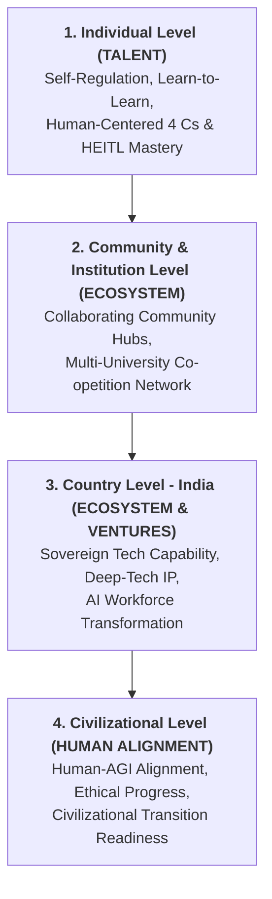
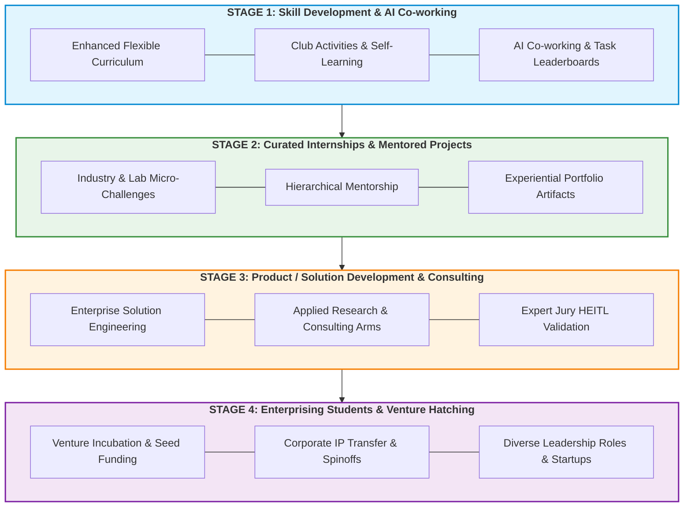
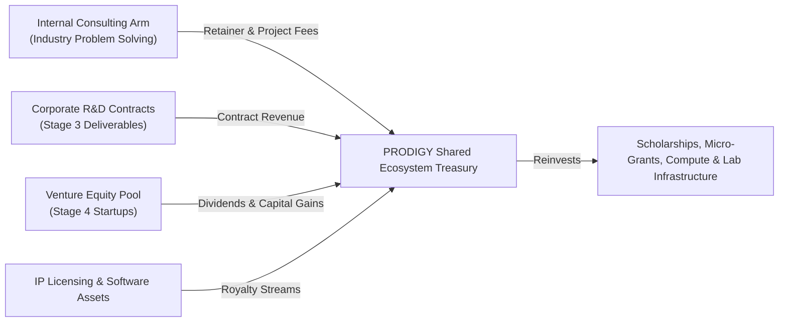

# EXECUTIVE CONCEPT NOTE: PROJECT PRODIGY

> **WHAT:** **P**ipeline for **R**esearch **O**riented **D**evelopment with **I**ntelligence of **G**lobal **Y**outh  
>
> **HOW:** *Building Our Common Future through Human + Augmented Intelligence — A Collaborative Community based Venture Studio for Multi-Tiered Human Centric Development in the AGI Era*  
>
> **RESULTING IN (STRATEGIC TRIAD):**  
> $$\mathbf{TALENT} \;\;\bullet\;\; \mathbf{ECOSYSTEM} \;\;\bullet\;\; \mathbf{VENTURES}$$  
>

---

## 📋 Table of Contents
- [1. Executive Summary](#1-executive-summary)
  - [1.1 The Executive Summary: WHY and HOW](#11-the-executive-summary-why-and-how)
  - [1.2 The Core Motto & Triad](#12-the-core-motto--triad)
  - [1.3 High-Concept Elevator Pitch](#13-high-concept-elevator-pitch)
- [2. Problem Statement & Strategic Vision](#2-problem-statement--strategic-vision)
  - [2.1 Multi-Level Problem Statement](#21-multi-level-problem-statement)
  - [2.2 Re-defined Inclusive STEAM Architecture](#22-re-defined-inclusive-steam-architecture)
- [3. The Operating Model: Collaborative Venture Studio + Collaborating Community](#3-the-operating-model-collaborative-venture-studio--collaborating-community)
  - [3.1 Role-Based Project Categories](#31-role-based-project-categories)
  - [3.2 Hub-and-Spoke Governance Architecture](#32-hub-and-spoke-governance-architecture)
- [4. The Srujana 4-Stage Pathway (Curriculum-Integrated Progression)](#4-the-srujana-4-stage-pathway-curriculum-integrated-progression)
  - [4.1 Visual Pathway Architecture (Mermaid)](#41-visual-pathway-architecture-mermaid)
  - [4.2 Detailed Breakout of the 4 Stages](#42-detailed-breakout-of-the-4-stages)
  - [4.3 Stage 4 Leadership Role Pathways](#43-stage-4-leadership-role-pathways)
  - [4.4 The Underlying Transformation Engine](#44-the-underlying-transformation-engine)
- [5. Sustainable Financial & Revenue Architecture](#5-sustainable-financial--revenue-architecture)
- [6. Stakeholder Value Proposition Matrix ("What's In It For Everyone")](#6-stakeholder-value-proposition-matrix-whats-in-it-for-everyone)
- [7. Single Business Value Dashboard & Key Performance Indicators (KPIs)](#7-single-business-value-dashboard--key-performance-indicators-kpis)
- [8. Executive Call to Action for Key Influencers in India](#8-executive-call-to-action-for-key-influencers-in-india)
- [9. Multi-Tier Ecosystem Governance & Team Architecture](#9-multi-tier-ecosystem-governance--team-architecture)
  - [9.1 Global Advisory Board](#91-global-advisory-board)
  - [9.2 Core Team (Project 0 Orchestrators)](#92-core-team-project-0-orchestrators)
  - [9.3 Educational Institutional Hub Governance (Universities & Colleges)](#93-educational-institutional-hub-governance-universities--colleges)
  - [9.4 Enterprise & Corporate Partner Governance](#94-enterprise--corporate-partner-governance)
  - [9.5 Expanded Mentorship & Ecosystem Network](#95-expanded-mentorship--ecosystem-network)
  - [9.6 Ecosystem Marketplace & Collaborator Directory](#96-ecosystem-marketplace--collaborator-directory)
- [10. Founder's Story & The "Why" Behind PRODIGY](#10-founders-story--the-why-behind-prodigy)

---

## 1. Executive Summary 

### 1.1 The Executive Summary: WHY and HOW
* **THE WHY (The Strategic Crisis & Societal Imperative)**:
  The unprecedented acceleration of Artificial General Intelligence (AGI) and Super-AI is triggering a profound structural transformation across global society, industry, and labor markets. As routine cognitive tasks and entry-level technical roles automate rapidly, traditional employment paradigms—especially fresher-level IT services and rote software roles—are disappearing. In this high-velocity shift, **educational institutions must assume fundamental responsibility** for leading a smooth, harmonious, and empowering societal transition. Universities and colleges can no longer remain passive degree-granting hubs; they must evolve into active, human-centered ecosystem anchors. To ensure long-term civilizational resilience, global youth must be cultivated as **Human-Experts-in-the-Loop (HEITL)** equipped with essential human-centric skills: the **4 Cs** (**C**ritical Thinking, **C**ommunication, **C**ollaboration, **C**reativity), personal agency, self-regulation, and a lifelong "learn-to-learn" mindset across all STEAM+ disciplines.

* **THE HOW (Key Operational Idea & Structural Strategy)**:
  Crucially, **the structure of community projects itself inherently enforces collaboration and specific focused outcomes.** Instead of passive learning, every activity is structured as an outcome-based project where participants progress through a 4-stage pathway (the **Srujana Pathway**: *1. Foundational Skills & Readiness $\rightarrow$ 2. Practical Exposure & Internships $\rightarrow$ 3. Product R&D & Deep Inquiry $\rightarrow$ 4. Enterprise Incubation & Elite Placement*), underpinned by four core philosophy pillars: **Learn by Doing, Augmented by AI, With Human-Centric Skills, Resulting in AI-Era Outcomes**.

```
┌────────────────────────────────────────────────────────────────────────────────────────┐
│                         PROJECT PRODIGY EXECUTION ARCHITECTURE                         │
├────────────────────────────────────────────────────────────────────────────────────────┤
│  1. TALENT PIPELINE (Stage 1 & Stage 2)                                                │
│     • Collaborative projects with specific success criteria & task leaderboards.        │
│     • Structural enforcement of 4 C skills, self-regulation, & AI co-working.          │
│     • Mentor hierarchy (Senior researchers, industry veterans, peer leads).            │
├────────────────────────────────────────────────────────────────────────────────────────┤
│  2. COLLABORATING COMMUNITY ECOSYSTEM (Stage 2 & Stage 3)                              │
│     • Co-opetition framework: Cooperate on shared pre-competitive R&D & compute;       │
│       compete on solution performance & speed-to-market.                               │
│     • Multi-institutional hub-and-spoke network across universities & industry.         │
├────────────────────────────────────────────────────────────────────────────────────────┤
│  3. VENTURES HATCHING (Stage 3 & Stage 4)                                              │
│     • High-performance Collaborative Venture Studio model.                             │
│     • Enterprise software deliverables, corporate R&D, IP transfer, & startups.       │
└────────────────────────────────────────────────────────────────────────────────────────┘
```

### 1.2 The Core Motto & Triad
PROJECT PRODIGY is anchored around three progressive pillars:
* **TALENT**: Developing human-centered capability through community-based project execution leading to human-centric skill development (4 Cs, personal agency, self-regulation, learn-to-learn mindset, and readiness to work as a Human-Expert-in-the-Loop with Augmented Intelligence across global youth).
* **ECOSYSTEM**: Fostering a self-sustaining, multi-stakeholder **Collaborating Community** network built on a **Co-opetition Model** (*Cooperating in pre-competitive foundational research, compute pooling, and talent building, while competing in downstream venture development and market execution*).
* **VENTURES**: Converting real-world solutions and Stage 3/4 engineering modules into market-ready products, corporate IP, enterprise consulting deliverables, and viable commercial startups for members who have progressed through the pathway.

### 1.3 High-Concept Elevator Pitch
PRODIGY represents a novel institutional synthesis: **A High-Performance Collaborative Venture Studio fused with the Collaborative Sector Model (inspired conceptually by India’s iconic Amul movement) operating via a Co-opetition Paradigm.**

* **The Collaborating Community Model (Co-opetition)**: Democratizes access so anyone with commitment can join at a "minus 1 or minus 2" level with zero barriers and Learn by Doing. Institutions and companies **cooperate** on shared resources, open R&D, and skill building in initial stages, while teams **compete** on later stages of solution creation and downstream venture deployment (**Talent & Ecosystem**).
* **The Venture Studio Rigor**: Provides structured product engineering, active mentorship, IP clearings, venture incubation, seed capitalization, and market launch pathways for members who have demonstrated high competence (**Ecosystem & Ventures**).

---

## 2. The Strategic Imperative: Civilizational Readiness in the AGI Era

The rapid progression toward AGI leaves a narrow strategic window. Traditional freshers-level job roles are disappearing. PRODIGY structures development across **four interconnected tiers**:



### 2.1 The Four Tiers of Development
1. **Individual Level (Talent)**: Cultivating personal agency, self-regulation, continuous learning ("learn-to-learn"), readiness to work as a Human-Expert-in-the-Loop, and human-centered skills: the **4 Cs** (**C**critical Thinking, **C**ommunication, **C**ollaboration, **C**reativity) and beyond.
2. **Community & Institutional Level (Ecosystem)**: Uniting universities, polytechnics, research centers, and industry nodes into a shared Collaborating Community network rather than siloed campuses.
3. **Country Level - India (Ecosystem & Ventures)**: Transitioning India’s massive demographic dividend from low-margin software maintenance to global IP generation, deep-tech research, and sovereign AI readiness.
4. **Civilizational Level**: Preparing human civilization for collaborative Intelligence with harmonious co-existence and leadership in the era of AGI and Super-AI.

### 2.2 Re-defined Inclusive STEAM Architecture
PROJECT PRODIGY adopts an expanded 5-part interpretation of **STEAM**:
* **S (Science & Mathematics)**: Pure & Applied Sciences, Mathematics, Computational Biology, Physics, Chemistry, Materials Science, Cryptography, Algorithmic Graph Theory, Statistical Modeling.
* **T (Technology & Engineering)**: Deep-Tech & Frontier Systems — **DefenseTech, SpaceTech, Quantum Computing, Optoelectronics, FinTech, AgriTech, HealthTech, EdTech, DeepTech, Autonomous Robotics, Edge Hardware, Semiconductor Design**.
* **E (Education)**: Andragogy & Heutagogy, AI-augmented pedagogy design, active learning seminars, experiential PBL/CBL methodologies, lifelong learning frameworks.
* **A (Arts & Humanities - Complete Spectrum)**:
  * **Psychology & Cognitive Science**: Human agency, mental health, cognitive ergonomics.
  * **Economics & Behavioral Finance**: Economic systems, game theory, incentive alignment.
  * **Sociology & Social Impact**: Socio-economic equity, community dynamics, digital inclusion.
  * **Political Science, Geopolitics & Public Policy**: Sovereign tech policies, international relations, governance.
  * **Philosophy & Ethics**: AI alignment, bioethics, epistemic logic.
  * **Indian Knowledge Systems (IKS)**: Holistic traditional knowledge, sustainable practices.
  * **Defense & Security Studies**: Sovereign security, cyber defense, strategic stability.
  * **Architecture & Urban Design**: Spatial intelligence, smart habitats, urban planning.
  * **Sports Science & Management**: Performance analytics, sports tech, wellness.
  * **Tourism, Experience Design & Hospitality**: Cultural heritage tech, eco-tourism, experience design.
* **M (Management & Administration)**: Organizational design, venture building, project governance, financial stewardship, cooperative sector economics, agile operations.

### 2.3 The Execution Engine: Agentic Graph Engineering & HEITL
PROJECT PRODIGY does not just teach about Artificial Intelligence; it **runs** on it. The entire ecosystem is structured as a collaborative venture between human experts and autonomous AI agents. 

We have moved beyond static "prompt engineering" into **Agentic Graph Engineering**. In this paradigm, AI operates as a system of interconnected nodes (a graph) where agents possess specific roles, memory, and toolchain access (like Antigravity SDK, VS Code with Copilot, and Claude Co-work).

Crucially, the human does not get replaced. **Using AI smartly is critical to avoid "brain rot."** The first focus should always be how much the human user has learned. The student or faculty member acts as the **Human Expert in the Loop (HEITL)**—the "Boss" of the AI agents. The HEITL defines the goal, provides context, and takes full responsibility for the final output through rigorous review, auditing, and verification to catch AI hallucinations. By managing AI agents to plan, track, and execute tasks, humans are forced into a continuous learning loop.

*For a deep dive into how this system works, read the [Agentic Graph Engineering Wiki](../wiki/agentic_graph_engineering.md).*

---

## 3. The Operating Model: Collaborative Venture Studio + Collaborating Community

### 3.1 Role-Based Project Categories
Collaboration and focused outcomes are structured across role-tailored project categories:

#### 1. Student Project Categories (Srujana Stages 1 to 4)
* **Self-Development & Personal Mastery Projects**: Micro-learning tasks, 4 C skill development, portfolio creation, self-regulation, learn-to-learn habits.
* **Co-Curricular & Community Event Projects**: Organizing and participating in hackathons, Learnathons, ideathons, debates, tech/cultural fests, and national/global study excursions to understand real-world societal friction.
* **Curriculum-Integrated Academic Projects**: Course capstone projects, semester projects for academic credits, mini-projects, final-year capstone projects.
* **Competitive & Fixed-Term Sprint Projects**: National and international challenge awards (e.g., Smart India Hackathon, FAER Scholar Awards, innovation competitions).
* **Srujana Stage 3 & Stage 4 Deep R&D & Venture Projects**: Enterprise-grade solution engineering, outcome-based consulting deliverables, patentable IP creation, startup spinoffs, and social enterprise launching.

#### 2. Faculty "TRACK" Project Categories
* **T (Teaching & Learning Projects)**: Pedagogy innovations, AI-augmented courseware design, experiential PBL/CBL lab modules, active learning seminar frameworks.
* **R (Research & Innovation Projects)**: Applied research probes, R&D grant proposals, TRL-based prototype development (TRL 1–9), peer-reviewed journal publications.
* **A (Academic Administration Projects)**: Departmental workflows, NEP 2020 alignment, institutional accreditation systems, lab infrastructure scaling.
* **C (Consulting & Venture Building Projects)**: Outcome-based paid corporate consulting (remunerated on milestone delivery), university spin-offs, IP commercialization.
* **K (Kaizen - Continuous Quality Improvement Projects)**: Self-improvement initiatives and institutional Kaizen projects for academic and operational excellence.

#### 3. Industry Engagement & Collaboration Formats (Srujana Stages 2, 3 & 4)
* **Industry-Mentored Campus Projects (Stage 2)**: Real-world problems submitted by industry partners, run physically at the institute campus with active industry mentoring (academic credit-backed, mostly unpaid).
* **Paid Internships, Apprenticeships & Co-Op Programs**: Executed physically at industry sites (at least a few days a week) or hybrid, outcome-focused and paid.
* **Outcome-Based Corporate Consulting (Stage 3 & 4)**: Paid corporate deliverables based strictly on milestone completion rather than fixed monthly stipends.
* **TRL-Based Research & Venture Projects**: Deep R&D and product development structured progressively across Technology Readiness Levels (**TRL 1 through TRL 9**).

### 3.2 Hub-and-Spoke Governance Architecture
* **Central Governing Council**: Industry captains, senior researchers, policy advisors, and venture builders defining strategic direction and quality standards.
* **Regional Nodal Hubs**: Established host universities and research centers providing local physical/digital workspace, compute access, and lab hardware.
* **Distributed Talent Spokes**: Student clubs, independent developers, faculty teams, and enterprise problem-solvers collaborating asynchronously via AI-augmented platforms.

---

## 4. The Srujana 4-Stage Pathway (Curriculum-Integrated Progression)

The backbone of PRODIGY is the **Srujana Pathway**, designed to be embedded directly into undergraduate (UG), postgraduate (PG), and doctoral/research curricula, or pursued via flexible co-curricular tracks. Participants progress through 4 distinct stages based on their commitment and capabilities.

### 4.1 Visual Pathway Architecture (Mermaid)



### 4.2 Detailed Breakout of the 4 Stages

| Stage | Branding Triad Progression | Focus & Activities | Curriculum & Platform Integration | Primary Outcomes |
| :--- | :--- | :--- | :--- | :--- |
| **Stage 1: Knowledge, Skill & Attitude Development** | **TALENT** *(Cooperative Learning)* | Flexible enhanced curriculum, student club activities, self-paced learning, competitive micro-task leaderboards, hackathons, study excursions. | Embedded in UG/PG foundational courses & student clubs. | Self-regulation, AI tool mastery, learn-to-learn attitude, foundational 4 Cs. |
| **Stage 2: Curated Internships & Mentored Projects** | **TALENT $\rightarrow$ ECOSYSTEM** *(Mentored Projects)* | Industry-mentored campus projects, paid physical Co-Op programs, lab micro-challenges. Active 1-on-1 and group mentorship. | Recognized for academic credits & industry internship mandates. | Experiential learning, professional discipline, portfolio artifacts, peer validation. |
| **Stage 3: Product / Solution Development & Consulting** | **ECOSYSTEM $\rightarrow$ VENTURES** *(Pre-Competitive Solutions)* | Enterprise-grade solutions, outcome-based corporate consulting, applied research across TRL 1-9. | Capstone projects, M.Tech/Ph.D. research, internal consulting arm engagements. | High-impact product modules, client revenues, research papers, Expert Jury HEITL validation. |
| **Stage 4: Enterprising Students & Venture Hatching** | **VENTURES** *(Market Competition)* | Venture creation, startup incubation, seed funding access, corporate IP transfer, and leadership placement across strategic sectors. | Business incubators, university spinoffs, public/defense leadership recruiting. | Commercial startups, equity distribution, revenue-sharing, diverse leadership roles. |

### 4.3 Stage 4 Leadership Role Pathways
Stage 4 prepares participants for 5 distinct high-impact leadership pathways:
1. **🏛️ Public Service & Governance Leadership**: Policy architects, civil service tech directors, Digital Public Infrastructure (DPI) leads shaping sovereign governance.
2. **🛡️ Defense & Strategic Sector Leadership**: Sovereign security leads, DefenseTech R&D officers, strategic capability directors.
3. **🌱 Social Sector & Civic Leadership**: Social enterprise founders, non-profit directors, civic technology leaders addressing rural and environmental challenges.
4. **🔬 Academic & Deep R&D Leadership**: Principal investigators, lab directors, Ph.D. fellows, and institute faculty leading frontier research.
5. **🚀 Commercial Venture & Corporate Leadership**: Startup founders, CTOs, corporate innovation leads, and venture studio partners.

### 4.4 The Underlying Transformation Engine
Across all four stages, PRODIGY operates on a unified underlying engine:
$$\text{Learn by Doing} + \text{Augmented by AI} + \text{Human-Centered Skills} \implies \text{AI-Era Careers & Leadership} + \text{Products/Portfolio} + \text{Branding/Legacy}$$

---

## 5. Sustainable Financial & Revenue Architecture

PRODIGY is designed as a **self-sustaining ecosystem** that does not rely indefinitely on grants or donations:



1. **Internal Consulting Arm**: Stage 3 and Stage 4 teams solve real-world operational and technological challenges for corporate clients, generating immediate cash flow.
2. **Corporate Contract R&D**: Companies outsource specialized exploratory R&D to PRODIGY nodal hubs at a fraction of standard R&D costs.
3. **Venture Studio Equity Pool**: PRODIGY retains a modest equity or revenue-share stake in Stage 4 startup spinoffs. Capital realizations are recycled back into early-stage Srujana micro-grants.
4. **Shared Compute & Resource Efficiency**: By pooling AI compute, software licenses, and cloud credits across participating institutions, fixed overhead per student is minimized.

---

## 6. Stakeholder Value Proposition Matrix ("What's In It For Everyone")

For a collaborative community to succeed, every stakeholder must receive unambiguous, tangible value mapped directly to **Talent, Ecosystem, and Ventures**:

| Stakeholder Group | Branding Focus | What They Give (Contribution) | What They Get (Value Proposition) |
| :--- | :--- | :--- | :--- |
| **Students & Youth** | **TALENT** | Time, commitment to self-development, micro-task contributions, problem-solving. | Zero-barrier entry, AI-era skill mastery, curated industry internships, verified portfolio/branding, marquee careers, or startup founder pathway. |
| **Universities & Faculty** | **ECOSYSTEM** | Infrastructure host, academic credits integration, faculty mentorship. | High-tier industry-relevant curriculum, boosted campus placement metrics, faculty research grants, consulting revenue share, spin-off IP rights. |
| **Government & Policy Makers** | **ECOSYSTEM & NATION** | Policy alignment, regional hub support, innovation grants. | Sovereign tech capability, massive workforce upskilling in AI, economic growth in Tier-2/3 cities, alignment with National Education Policy (NEP) goals. |
| **Mentors & Experts** | **TALENT & ECOSYSTEM** | Domain guidance, jury evaluation, HEITL oversight. | Access to high-energy talent for their own projects, equity co-founding options, advisory fees, continuous connection to cutting-edge AI practices. |
| **Industry & Enterprises** | **VENTURES** | Problem statements, dataset access, expert mentors, project sponsorships. | Access to pre-vetted top talent, rapid low-cost R&D prototyping, custom AI solution deployment, reduced recruitment and training overhead. |

---

## 7. Single Business Value Dashboard & Key Performance Indicators (KPIs)

To maintain execution discipline, PRODIGY tracks progress across the **Talent $\rightarrow$ Ecosystem $\rightarrow$ Ventures** triad through a unified, real-time value dashboard:

```
┌────────────────────────────────────────────────────────────────────────────────────────┐
│                        PRODIGY BUSINESS VALUE DASHBOARD                                │
├──────────────────────────┬──────────────────────────┬──────────────────────────────────┤
│ BRANDING TRIAD CATEGORY  │ KEY INDICATOR            │ TARGET BENCHMARK                 │
├──────────────────────────┼──────────────────────────┼──────────────────────────────────┤
│ 1. TALENT                │ Sprint Tasks Completed   │ >50 micro-tasks per nodal hub    │
│                          │ Leaderboard Velocity     │ Active engagement from >80% youth│
├──────────────────────────┼──────────────────────────┼──────────────────────────────────┤
│ 2. ECOSYSTEM             │ Problem Viability Index  │ Top 20% high-friction industry   │
│                          │ Co-opetition Pool Index  │ >10 institutions sharing compute │
├──────────────────────────┼──────────────────────────┼──────────────────────────────────┤
│ 3. VENTURES              │ Solution Maturity Rubric │ >85% Expert Jury HEITL approval  │
│                          │ Client Acceptance Rate   │ >90% code/product deployment     │
├──────────────────────────┼──────────────────────────┼──────────────────────────────────┤
│ 4. SCALE & YIELD         │ Startups Incubated       │ 10-15 viable ventures / year     │
│                          │ Revenue Re-invested      │ 100% self-sustaining within 3 yrs│
└──────────────────────────┴──────────────────────────┴──────────────────────────────────┘
```

---

## 8. Executive Call to Action for Key Influencers in India

India stands at a pivotal historical junction. With its demographic advantage and technical ambition, India can lead the world in human-centered, AI-augmented collaborative innovation. 

We invite key leaders across policy, academia, industry, and venture capital to advise, partner, and shape PROJECT PRODIGY across its three pillars.

---

## 9. Multi-Tier Ecosystem Governance & Team Architecture

PROJECT PRODIGY enforces operational excellence, institutional accountability, and inclusive participation through a structured 6-level governance framework:

```
┌────────────────────────────────────────────────────────────────────────────────────────┐
│                        PRODIGY MULTI-TIER GOVERNANCE ARCHITECTURE                      │
├────────────────────────────────────────────────────────────────────────────────────────┤
│ 🌐 1. GLOBAL ADVISORY BOARD                                                            │
│    • Eminent global leaders across AI, research, higher ed, and venture capital.        │
├────────────────────────────────────────────────────────────────────────────────────────┤
│ ⚡ 2. CORE TEAM (PROJECT 0 STUDIO ORCHESTRATORS)                                       │
│    • Lead Orchestrator: Dr. Sanjay Chitnis (sanjay.chitnis@gmail.com).                 │
│    • Core contributors, system architects, and AI subagent guild.                      │
├────────────────────────────────────────────────────────────────────────────────────────┤
│ 🏛️ 3. EDUCATIONAL INSTITUTIONAL HUBS (UNIVERSITIES & COLLEGES)                        │
│    • 1 Executive Sponsor (VC / Director / Dean).                                       │
│    • 4 Single Points of Contact: 2 Faculty SPOCs + 2 Student SPOCs.                    │
├────────────────────────────────────────────────────────────────────────────────────────┤
│ 🏢 4. ENTERPRISE & CORPORATE PARTNERS                                                  │
│    • 1 Executive Sponsor (CTO / VP R&D) + 1 Technical SPOC + 1 HR/Talent SPOC.          │
├────────────────────────────────────────────────────────────────────────────────────────┤
│ 🧙‍♂️ 5. 5-TIER MENTORSHIP HIERARCHY                                                      │
│    • Tier A: Peer Mentors | Tier B: Faculty Mentors | Tier C: Industry / CTO Mentors    │
│    • Tier D: Domain Experts | Tier E: Strategic Advisors.                              │
├────────────────────────────────────────────────────────────────────────────────────────┤
│ 🤝 6. ECOSYSTEM MARKETPLACE & COLLABORATOR DIRECTORY                                   │
│    • Public directory connecting learners seeking collaborators, SPOCs, & mentors.      │
└────────────────────────────────────────────────────────────────────────────────────────┘
```

### 9.1 Global Advisory Board
The Global Advisory Board comprises eminent leaders, researchers, and venture builders providing macro strategic alignment, ethical oversight, and global ecosystem connectivity (drawing inspiration from iSPIRT DPI, MIT Media Lab, Minerva, and École 42 paradigms).

### 9.2 Core Team (Project 0 Orchestrators)
The Core Team drives **Project 0**—the ongoing engineering effort to build, resource, deploy, and scale PRODIGY as an operational platform:
* **Founder & Lead Studio Orchestrator**: **Dr. Sanjay Chitnis** (`sanjay.chitnis@gmail.com`)
* **Core Studio Contributors & AI Subagent Guild**: Open invitation for software architects, community managers, prompt engineers, and HEITL jury leads.

### 9.3 Educational Institutional Hub Governance (Universities & Colleges)
Each participating university or engineering institute establishes a standardized governance node:
* **1 Executive Sponsor**: Vice-Chancellor, Director, Principal, or Dean providing institutional support, lab resources, and academic credit approvals.
* **4 Single Points of Contact (SPOCs)**:
  * **2 Faculty SPOCs**: Responsible for embedding Srujana Pathway R&D into STEAM curricula, tracking student progress, and guiding lab work.
  * **2 Student SPOCs**: Responsible for student club leadership, micro-challenge sprint velocity, and peer onboarding.

### 9.4 Enterprise & Corporate Partner Governance
Corporate R&D partners, startups, and civic institutions operate under a 3-part contact structure:
* **1 Executive Sponsor**: CTO, VP of Engineering, or Managing Director driving corporate engagement and problem statement funding.
* **1 Operational SPOC**: Technical lead managing real-world problem statement pipelines, data access, and weekly sprint reviews.
* **1 HR / Talent SPOC**: Talent lead managing internship recruitment, hiring, and Stage 4 career placements.

### 9.5 Expanded Mentorship & Ecosystem Network
Mentorship in PRODIGY operates across 5 core tiers plus 2 ecosystem liaison categories:
1. **Tier A: Peer Mentors**: Advanced Stage 3 & 4 student leads providing day-to-day peer code reviews, prompt auditing, and sprint guidance.
2. **Tier B: Faculty Mentors**: Campus professors guiding TRACK projects (Teaching, Research, Administration, Consulting, Kaizen), academic supervision, and methodology oversight.
3. **Tier C: Industry / R&D Mentors**: CTOs, Chief Architects, and Senior Engineers providing overall technical direction, TRL-based product architecture, and project oversight.
4. **Tier D: STEAM+ Domain Experts**: Subject matter specialists across:
   * **Science & Maths**: Pure & Applied Sciences, Computational Biology, Physics, Chemistry, Materials Science, Cryptography, Graph Theory.
   * **Frontier Technology**: **DefenseTech, SpaceTech, Quantum Computing, Optoelectronics, FinTech, AgriTech, HealthTech, EdTech, DeepTech, Autonomous Robotics**.
   * **Education**: Pedagogy/Andragogy design, experiential PBL/CBL methodologies, curriculum innovation.
   * **Humanities Spectrum**: Psychology, Economics, Sociology, Political Science, Philosophy, Indian Knowledge Systems (IKS), Geopolitics, Defense & Security Studies, Public Policy, Architecture, Sports Science, Tourism & Experience Design.
   * **Management & Administration**: Organizational design, venture building, project governance, financial stewardship.
5. **Tier E: Strategic Advisors**: Global ecosystem leaders guiding venture incubation, capital deployment, and institutional partnerships.
6. **Government & R&D Ecosystem Liaisons**: Policy makers, national lab directors, R&D program officers, and government scheme liaisons (e.g. DST, MeitY, NITI Aayog, BIRAC, iDEX).
7. **Innovation & Entrepreneurship Ecosystem Experts**: Incubator & accelerator directors, serial venture studio strategists, startup founders, and ecosystem builders.

### 9.6 Ecosystem Marketplace & Collaborator Directory
PRODIGY maintains an interactive marketplace directory (on the web portal and workspace wiki) where participants, student teams, and institutional leads can list open projects, request faculty SPOCs, or connect with CTO-level mentors.

---

## 10. Founder's Story & The "Why" Behind PRODIGY

*“My journey with AI started during my M.Tech at IIT Kanpur and PhD at IISc, eventually leading me through multinational GCCs like Motorola and LG. I saw how the world's best tech companies operate.*

*I returned to academics because I realized our future generation has immense potential but lacks the right runway. PRODIGY is my way of being an enabler—a catalyst to help students realize their highest aspirations in a rapidly changing world.”*

**— Dr. Sanjay Chitnis, Founder & Lead Studio Orchestrator**  
[Connect with me on LinkedIn](https://www.linkedin.com/in/sanjaychitnis/)

---

### Contact & Related Documents
* **Initiative Lead & Founder**: **Dr. Sanjay Chitnis** (`sanjay.chitnis@gmail.com`)
* **Executive Concept Note**: [strategy/concept-note.md](file:///d:/Github/prodigy/strategy/concept-note.md)
* **SPOT-PROBE Strategy Reference**: [wiki/spot_probe_strategy.md](file:///d:/Github/prodigy/wiki/spot_probe_strategy.md)
* **Getting Started Guide**: [docs/getting_started_guide.md](file:///d:/Github/prodigy/docs/getting_started_guide.md)
* **Agentic Graph Guidelines**: [AGENTS.md](file:///d:/Github/prodigy/AGENTS.md)
