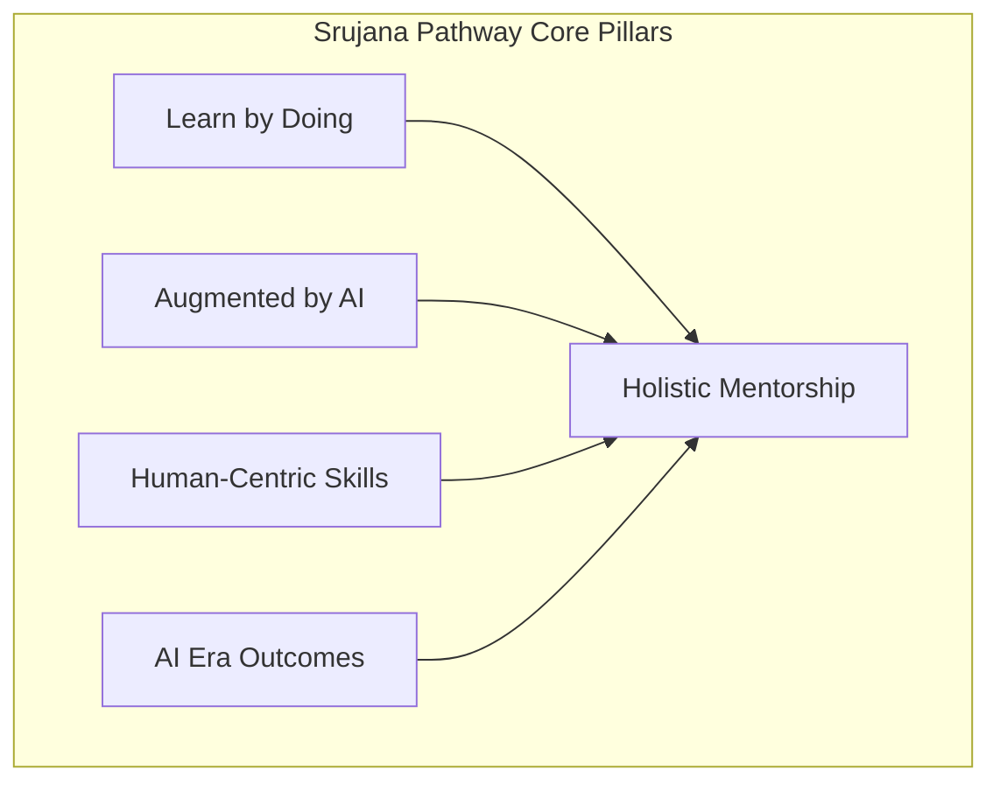

# The Srujana Pathway for All Learners

The **Srujana Pathway** outlines a comprehensive framework for mentoring **learners of all types**—students, aspiring professionals, and lifelong learners—across four developmental stages. 

In the era of **Abundant Intelligence**, the underlying structure of this pathway remains robust, but the *substance* of what is learned and executed shifts dramatically from manual task execution to AI agent orchestration and high-order human judgment.

---

## The Four Developmental Stages

The Srujana Pathway is highly flexible, allowing learners to complete one, two, three, or all four stages based on their individual interests, career aspirations, and capabilities.

### 1. Developing Foundational Skills (AI Literacy & Meta-Learning)
* **Focus**: Transitioning from rote memorization to cognitive agility and AI literacy.
* **Mechanism**: Flexible curricula, community hackathons, and self-paced learning via AI tutors.
* **The Abundant Intelligence Shift**: Learners do not just learn basic coding or theory; they master **meta-learning, prompt and context engineering, problem deconstruction**, and the critical evaluation/red-teaming of synthetic AI outputs.
* **Mentoring Approach**: Mentors guide learners in acquiring these modern core competencies and developing a resilient growth mindset.

### 2. Practical Real-World Application (AI Orchestration Internships)
* **Focus**: Applying knowledge in real-world workflows.
* **Mechanism**: Industry-mentored projects and apprenticeships.
* **The Abundant Intelligence Shift**: Because AI agents handle routine "grunt work," internships shift to **AI Agent Orchestration**. Learners practice directing multi-agent workflows, managing data governance, mitigating hallucination risks, and applying high-level human judgment.
* **Mentoring Approach**: Mentors connect learners with industry and guide them on professional accountability and strategic oversight.

### 3. Product, Solution Development, Consulting, or Research
* **Focus**: Deep inquiry and accelerated value creation.
* **Mechanism**: Designing tangible products, providing consulting services, or conducting applied research.
* **The Abundant Intelligence Shift**: Creation is hyper-accelerated. Learners act as **Systems Architects**, orchestrating foundation models to rapidly prototype complex solutions. The focus elevates from *how to build it* to *what to build* and *why it matters ethically*.
* **Mentoring Approach**: Mentors work alongside learners as advisors, driving the transition from passive learning to active creation and intellectual property generation.

### 4. Enterprise Incubation and Elite Career Placement
* **Focus**: Commercialization and elite career placement.
* **Mechanism**: Securing marquee careers, executing consulting contracts, or launching startup ventures.
* **The Abundant Intelligence Shift**: Learners secure **AI-Era Careers** that require strategic orchestration rather than task execution. Incubated startups operate as **AI-Native Ventures**, where small learner teams achieve the output of massive traditional companies.
* **Mentoring Approach**: Mentors act as business advisors and career strategists, steering high-capability learners toward institutional scale or investment readiness.

---

## The Underlying Mentoring Philosophy

### I. Learn by Doing
Mentoring is experiential. At every stage, learners learn by building, testing, failing, and iterating. Mentors provide immediate feedback on active, deployed projects rather than theoretical assessments.

### II. Augmented by AI (The Nervous System)
"Augmented by AI" is no longer just a nice-to-have tool; it is the central nervous system of the pathway. Mentors train learners to utilize AI tools as strategic force-multipliers to accelerate research, automate repetitive tasks, and enhance productivity. 

### III. With Human-Centric Skills (The Ultimate Differentiator)
As technical tasks become increasingly automated by Abundant Intelligence, this pillar is no longer a "soft skill" add-on. **Unique human capabilities become the primary competitive differentiator.** Mentors place a premium on critical thinking, ethics, emotional intelligence, moral grounding, leadership, collaboration, and communication.

### IV. Resulting in AI Era Careers, Products/Portfolio, and Branding
The ultimate goal is tangible impact in the new economy:
* **AI Era Careers**: Securing high-value, future-proof roles centered on strategic judgment.
* **Products & Portfolios**: Compiling a documented portfolio of functional agentic code, published research, or deployed ventures.
* **Branding**: Establishing deep professional credibility and thought leadership.
